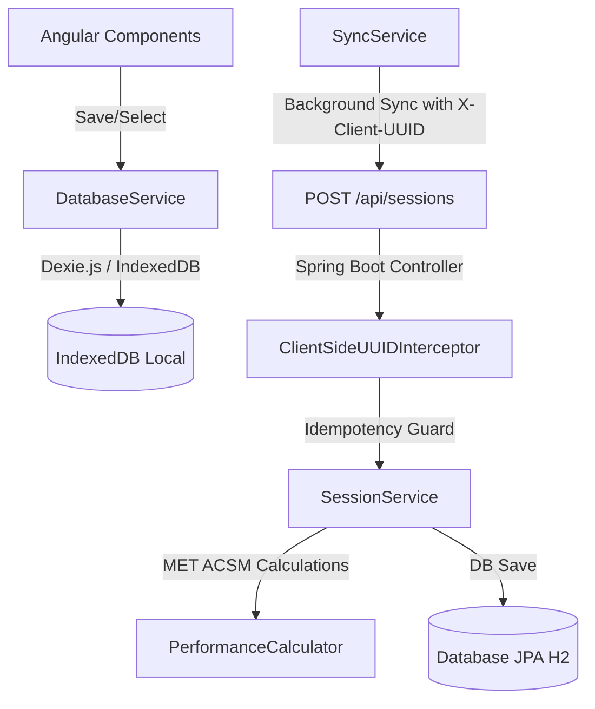

# RT (Race Tracker)

RT (Race Tracker) is a physical performance tracking application for runners. It provides multi-profile runner switching, street runs (with a precise stopwatch and manual entry), and treadmill workouts (with automated machine speed consistency checks).

The project is structured as a monorepo containing:
* **`/frontend`**: Angular 19 SPA, using Dexie.js (IndexedDB) for offline-first logging and background synchronization.
* **`/backend`**: Java Spring Boot 3 REST API for final calculations authority and database persistence.

---

## 🛠 Project Architecture

RT uses a **Write-to-Local-First** synchronization model to support full offline capabilities:



---

## 🚀 How to Run

### 1. Run the Backend API (Java Spring Boot)
```bash
cd backend
mvn spring-boot:run
```
* API Server starts on port `8080` (`http://localhost:8080`).

### 2. Run the Frontend App (Angular)
```bash
cd frontend
npm install
npm run start
```
* Web App starts on port `4200` (`http://localhost:4200`).
